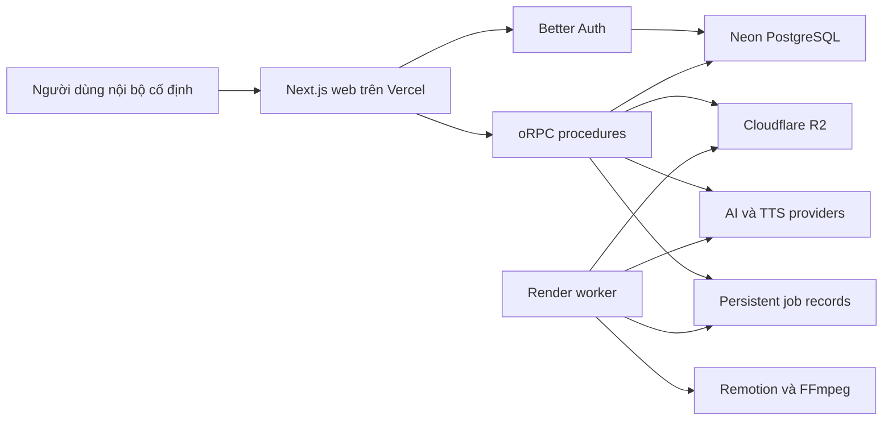
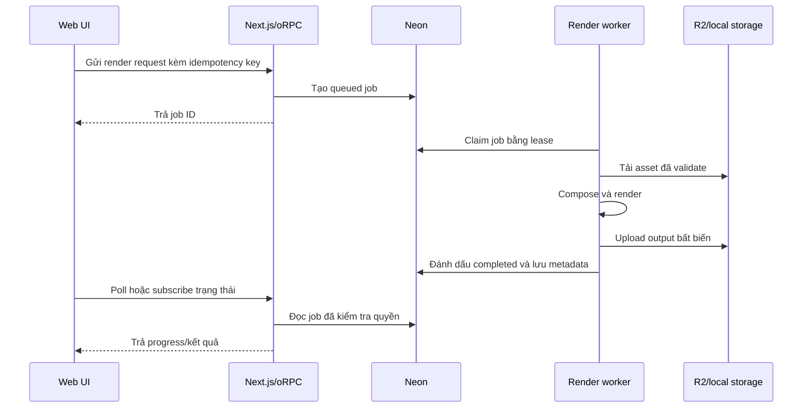

# Kiến trúc AffiChannel

- Trạng thái: Bản nháp
- Phiên bản: 0.1.0
- Cập nhật lần cuối: 2026-08-10

## 1. Mục tiêu kiến trúc

- Giữ luồng end-to-end đầu tiên đủ đơn giản cho một lập trình viên.
- Cho phép thay thế provider, storage và cách render.
- Thực thi authorization và các quy tắc workflow ở server.
- Lưu trạng thái job dài hạn bên ngoài vòng đời một web request.
- Cho phép truy vết fact, chi phí, asset AI và metrics.
- Không gắn business logic chặt vào Next.js route handler hoặc UI component.

## 2. Công nghệ hiện tại

| Khu vực | Lựa chọn |
|---|---|
| Web | Next.js 16 App Router và React 19 |
| API | oRPC với Zod contract và OpenAPI reference |
| Dữ liệu client | TanStack Query |
| Auth | Better Auth với email/mật khẩu |
| Database | Neon PostgreSQL |
| ORM | Drizzle ORM, ban đầu dùng Neon HTTP driver |
| UI | Tailwind CSS và shared shadcn-style primitives |
| Repository | pnpm workspace và Turborepo |
| Chất lượng | TypeScript và Biome |
| Deploy web | Vercel |
| Object storage | Cloudflare R2, thêm khi bắt đầu upload media |
| Render | Remotion và FFmpeg trong worker riêng |

`runtime: none` trong metadata scaffold nghĩa là không sinh backend runtime riêng.
Ứng dụng full-stack Next.js vẫn chạy code server trên Node.js runtime.

## 3. Cấu trúc repository mục tiêu

```text
affichannel/
├─ apps/
│  ├─ web/                  Next.js UI, auth route và oRPC transport
│  └─ worker/               Render và xử lý job dài hạn (thêm sau)
├─ packages/
│  ├─ api/                  oRPC procedure và request context
│  ├─ auth/                 Cấu hình Better Auth
│  ├─ core/                 Domain rule và application service (sẽ thêm)
│  ├─ db/                   Drizzle schema, migration và repository
│  ├─ env/                  Biến môi trường đã validate
│  ├─ storage/              Adapter R2/local (sẽ thêm)
│  ├─ ui/                   Shared UI primitive và token
│  └─ video/                Remotion composition và render contract (sẽ thêm)
├─ docs/                    Tài liệu sản phẩm và kỹ thuật chuẩn
└─ AGENTS.md                Quy tắc chung cho agent
```

Không đặt domain behavior tái sử dụng trong React component, route handler hoặc
worker entry point. Hãy đặt trong `packages/core` và gọi từ từng transport.

## 4. Ngữ cảnh hệ thống



## 5. Ranh giới request

### Server Components

Server Components có thể gọi trực tiếp application service hoặc read-model
function. Không gọi ngược HTTP endpoint của chính ứng dụng vì tạo thêm request
vòng không cần thiết.

### oRPC

Sử dụng oRPC cho:

- query và mutation bắt nguồn từ trình duyệt;
- polling hoặc event stream phía client;
- chuẩn bị upload và thao tác signed URL;
- API rõ ràng dành cho worker tương lai;
- thao tác cần typed contract công khai.

Một oRPC procedure thực hiện theo thứ tự:

1. validate input;
2. lấy authenticated session;
3. kiểm tra authorization ở mức bản ghi;
4. gọi application service;
5. ánh xạ typed error;
6. serialize response an toàn.

### Better Auth

Better Auth giữ endpoint `/api/auth/[...all]`. Không proxy qua oRPC. Kiểm tra
session cookie có thể cải thiện UX điều hướng, nhưng mọi page và procedure được
bảo vệ vẫn phải kiểm tra session và ownership thực sự.

### OpenAPI reference

API reference sinh tự động chỉ dành cho development. Tắt trong production hoặc
yêu cầu người dùng nội bộ đã đăng nhập.

## 6. Các domain module ban đầu

Triển khai module theo thứ tự phụ thuộc:

```text
identity
→ products
→ product-facts
→ projects
→ scripts
→ fact-lock
→ media
→ voice
→ video-composition
→ render-jobs
→ publishing
→ metrics
→ analytics
```

Mỗi module nên cung cấp application service và repository interface, không làm
rò rỉ transport object.

## 7. Data model ban đầu

Schema đầu tiên chỉ thêm những gì vertical slice hiện tại cần:

- Bảng Better Auth: `user`, `session`, `account`, `verification`.
- `product`.
- `product_fact`.
- `project`.
- `script_version`.
- `fact_check_run` và `claim_review` khi bắt đầu Fact Lock.

Quy tắc chung:

- Dùng opaque ID do ứng dụng tạo.
- Lưu timestamp theo UTC và hiển thị theo timezone cấu hình.
- Dùng `createdAt` và `updatedAt` nhất quán.
- Ưu tiên archive/chuyển trạng thái thay vì xóa cứng khi có bản ghi phụ thuộc.
- Thêm index cho foreign key và đường filter/sort thường dùng.
- Dùng unique constraint cho idempotency, không chỉ kiểm tra ở application.
- Mọi aggregate được bảo vệ phải lưu ownership hoặc group scope.

Không tạo tất cả bảng tương lai trong migration đầu tiên. Thêm schema cùng
vertical slice thực sự sử dụng nó.

## 8. Transaction và Neon

Database package hiện dùng `drizzle-orm/neon-http`, phù hợp với serverless
request ngắn. Trước workflow cần interactive transaction, phải xác nhận hỗ trợ
của driver và chuyển các đường đó sang Neon driver dùng pool/WebSocket nếu cần.

Import metrics, claim job và tạo version nhiều bản ghi phải atomic. Không giả lập
atomicity bằng nhiều request độc lập từ client.

## 9. Media và storage

Database chỉ lưu metadata và object key, không lưu binary media.

Storage adapter phải hỗ trợ:

- signed upload/download URL;
- giới hạn content type và kích thước;
- tạo object key độc lập với tên file gốc;
- checksum metadata;
- kiểm tra ownership trước khi ký URL;
- dọn file tạm;
- implementation local và R2 sau cùng một interface.

Khi phù hợp, phải validate MIME, extension, metadata đã decode, kích thước, thời
lượng, độ phân giải và domain nguồn. Coi URL đầu ra từ provider là input không
đáng tin cậy.

## 10. Kiến trúc job

Vercel tạo job và đọc trạng thái. Vercel không chạy FFmpeg hoặc Remotion dài hạn.



Thuộc tính job bắt buộc:

- state machine rõ ràng;
- idempotency key và unique constraint;
- lease owner và thời điểm hết hạn;
- heartbeat hoặc timeout có thể khôi phục;
- số lần retry hữu hạn;
- failure reason có kiểu rõ ràng;
- progress chỉ chuyển theo transition hợp lệ;
- quy tắc cancel;
- snapshot input bất biến;
- chi phí dự kiến và thực tế khi có phát sinh.

## 11. Provider adapter

Text AI, TTS, Video AI và storage provider phải được chọn ở server bằng cấu hình.
UI không được import provider SDK.

Mọi adapter tốn phí cung cấp các khái niệm tương đương:

- validate input;
- ước tính chi phí;
- submit hoặc execute;
- lấy provider request/job ID;
- chuẩn hóa trạng thái và lỗi;
- ghi actual cost/refund nếu có;
- loại secret và dữ liệu nhạy cảm khỏi log.

Provider relay bên thứ ba vẫn là thử nghiệm cho đến khi xác minh privacy, nguồn
upstream, độ ổn định và cơ chế refund.

## 12. Kiến trúc Fact Lock

Fact Lock gồm các giai đoạn riêng:

1. tách candidate claim từ script version bất biến;
2. chuẩn hóa tên, giá trị, đơn vị, ngày và điều kiện khuyến mại;
3. đề xuất Product Facts có khả năng hỗ trợ;
4. áp dụng deterministic rule nếu có;
5. yêu cầu con người xử lý điểm mơ hồ;
6. lưu evidence link và lý do;
7. tính trạng thái tổng của run.

LLM output là structured input không đáng tin cậy và phải qua schema validation.
Model không được tự ghi trạng thái approved cuối cùng nếu thiếu server-side rule
và kiểm tra bằng chứng.

## 13. Bất biến bảo mật

- Secret được validate ở server và không xuất qua `NEXT_PUBLIC_*`.
- Log loại credential, cookie, authorization header, signed URL và provider key.
- Procedure kiểm tra cả hành động và ownership bản ghi.
- File upload/download luôn được coi là không đáng tin cậy.
- URL bên ngoài được kiểm tra protocol và destination để giảm nguy cơ SSRF.
- Tham số FFmpeg được dựng từ giá trị đã validate, không nối từ raw user input.
- Có thể tắt đăng ký production sau khi tạo đủ tài khoản cố định.
- API reference và diagnostics không công khai trong production.

## 14. Cấu hình

Biến môi trường được khai báo và validate trong `packages/env`. Code mới không
đọc trực tiếp `process.env` ngoài package đó, trừ file cấu hình công cụ bắt buộc.

Biến bắt buộc hiện tại:

- `DATABASE_URL`;
- `DATABASE_URL_DIRECT` cho schema tooling;
- `BETTER_AUTH_SECRET`;
- `BETTER_AUTH_URL`;
- `CORS_ORIGIN`.

Chỉ thêm biến R2, AI, TTS và worker khi bắt đầu vertical slice tương ứng.

## 15. Cổng chất lượng

Trước khi hoàn thành một slice:

- Acceptance Criteria đạt;
- type-check đạt;
- Biome đạt mà không rewrite file không liên quan;
- migration được generate và review khi đổi schema;
- test authorization bao gồm truy cập chéo người dùng;
- domain rule quan trọng có unit test;
- luồng chính có integration hoặc Playwright test khi thực tế;
- tài liệu và tiến trình AI được cập nhật.

## 16. Các giai đoạn deploy

### Development local

- Next.js tại port 3001.
- Neon development database.
- Có thể dùng local filesystem adapter cho thử nghiệm media ban đầu.
- Local render worker khi bắt đầu render.

### Production web

- Vercel cho Next.js.
- Neon cho PostgreSQL.
- R2 cho media và output render.
- Worker deploy riêng hoặc local worker được vận hành rõ ràng.

Agent không tự deploy production nếu chủ dự án chưa cho phép rõ ràng.
