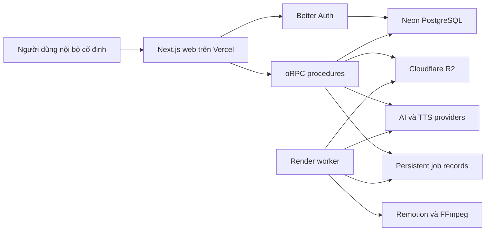
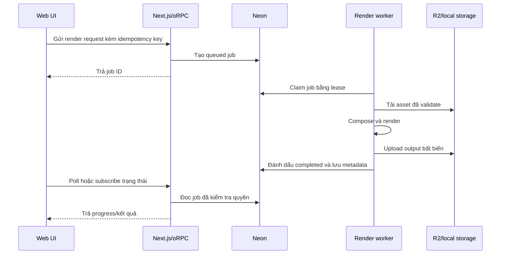

# Kiến trúc AffiChannel

- Trạng thái: Channel-First identity rollout M1–M5 accepted; M4 shadow retained;
  future identities vẫn gated; AFF-US-019 19A.2 contract đã lock
- Phiên bản: 0.8.0
- Cập nhật lần cuối: 2026-09-02

## 1. Mục tiêu kiến trúc

- Giữ luồng end-to-end đầu tiên đủ đơn giản cho một lập trình viên.
- Cho phép thay thế provider, storage và cách render.
- Thực thi authorization và các quy tắc workflow ở server.
- Cho phép Organic/Affiliate và nhiều creation path dùng chung một workflow
  adaptive mà không làm mất golden affiliate flow.
- Lưu trạng thái job dài hạn bên ngoài vòng đời một web request.
- Cho phép truy vết fact, chi phí, asset AI và metrics.
- Không gắn business logic chặt vào Next.js route handler hoặc UI component.

## 2. Công nghệ hiện tại

### M5 persisted identity enforcement boundary

DEC-030 phase cuối của Domain Evolution đã được enforce: bốn Channel-First identity
columns là NOT NULL sau zero-blocker preflight, không DB default/enum/registry
table; `product_id` vẫn nullable. Legacy request shape tiếp tục canonicalize trước
persistence; defensive read projection, identity CAS, M2 tooling và M4 shadow được
giữ qua rollback window. M5 không mở Organic/Quick Image/Media First, không thay
execution guards và không biến `currentStepKey` thành applicability authority.
Chi tiết tại `docs/domain-evolution-m5-enforcement-contract.md`.

| Khu vực | Lựa chọn |
|---|---|
| Web | Next.js 16 App Router và React 19 |
| API | oRPC với Zod contract và OpenAPI reference |
| Dữ liệu client | TanStack Query |
| Auth | Better Auth với email/mật khẩu |
| Database | Neon PostgreSQL |
| ORM | Drizzle ORM, ban đầu dùng Neon HTTP driver |
| UI | Tailwind CSS và shared shadcn-style primitives |
| Repository | pnpm workspace và Turborepo |
| Chất lượng | TypeScript và Biome |
| Deploy web | Vercel |
| Object storage | `VoiceAudioStorage` hiện hỗ trợ local dev/test và private Cloudflare R2 production; media/render storage còn mở rộng theo slice |
| Render | Remotion và FFmpeg trong worker riêng |

`runtime: none` trong metadata scaffold nghĩa là không sinh backend runtime riêng.
Ứng dụng full-stack Next.js vẫn chạy code server trên Node.js runtime.

## 3. Cấu trúc repository hiện tại và mục tiêu

```text
affichannel/
├─ apps/
│  ├─ web/                  Next.js UI, auth route và oRPC transport
│  └─ worker/               Render và xử lý job dài hạn (thêm sau)
├─ packages/
│  ├─ api/                  oRPC procedure và request context
│  ├─ auth/                 Cấu hình Better Auth
│  ├─ core/                 Shared domain policies, validators, errors và logic dùng chung hiện hữu
│  ├─ db/                   Drizzle schema, migration và repository
│  ├─ env/                  Biến môi trường đã validate
│  ├─ storage/              Package media/render storage mục tiêu; VoiceAudioStorage hiện ở packages/api/src/storage
│  ├─ ui/                   Shared UI primitive và token
│  └─ video/                Remotion composition và render contract (sẽ thêm)
├─ docs/                    Tài liệu sản phẩm và kỹ thuật chuẩn
└─ AGENTS.md                Quy tắc chung cho agent
```

Không đặt domain behavior tái sử dụng trong React component, route handler hoặc
worker entry point. Hãy đặt trong `packages/core` và gọi từ từng transport.

## 4. Ngữ cảnh hệ thống



## 5. Ranh giới request

### Server Components

Server Components có thể gọi trực tiếp application service hoặc read-model
function. Không gọi ngược HTTP endpoint của chính ứng dụng vì tạo thêm request
vòng không cần thiết.

### oRPC

Sử dụng oRPC cho:

- query và mutation bắt nguồn từ trình duyệt;
- polling hoặc event stream phía client;
- chuẩn bị upload và thao tác signed URL;
- API rõ ràng dành cho worker tương lai;
- thao tác cần typed contract công khai.

Một oRPC procedure thực hiện theo thứ tự:

1. validate input;
2. lấy authenticated session;
3. kiểm tra authorization ở mức bản ghi;
4. gọi application service;
5. ánh xạ typed error;
6. serialize response an toàn.

### Better Auth

Better Auth giữ endpoint `/api/auth/[...all]`. Không proxy qua oRPC. Kiểm tra
session cookie có thể cải thiện UX điều hướng, nhưng mọi page và procedure được
bảo vệ vẫn phải kiểm tra session và ownership thực sự.

### OpenAPI reference

API reference sinh tự động chỉ dành cho development. Tắt trong production hoặc
yêu cầu người dùng nội bộ đã đăng nhập.

## 6. Các domain module ban đầu

Triển khai module theo thứ tự phụ thuộc:

```text
identity
→ channel-settings
→ products
→ product-facts
→ projects
→ content-format
→ applicability
→ scripts
→ claim-manifest
→ fact-lock
→ media
→ voice
→ video-composition
→ render-jobs
→ publishing
→ metrics
→ analytics
```

Mỗi module nên cung cấp application service và repository interface, không làm
rò rỉ transport object.

## 7. Data model ban đầu

Schema đầu tiên chỉ thêm những gì vertical slice hiện tại cần:

- Bảng Better Auth: `user`, `session`, `account`, `verification`.
- `product`.
- `product_fact`.
- `project`.
- `script_generation` khi bắt đầu AFF-US-008; `script_version` chỉ thêm ở AFF-US-009.
- `fact_lock_run`, `fact_lock_claim` và `fact_lock_claim_fact` khi bắt đầu AFF-US-010.
- Domain Evolution đã thêm/enforce additive identity fields vào `project`.
  AFF-US-017 đã thêm dormant immutable `claim_manifest`, deterministic builder,
  repository và internal ScriptVersion service; AFF-US-018 sau đó mới mở rộng
  `fact_lock_run` theo Manifest-first contract.

Quy tắc chung:

- Dùng opaque ID do ứng dụng tạo.
- Lưu timestamp theo UTC và hiển thị theo timezone cấu hình.
- Dùng `createdAt` và `updatedAt` nhất quán.
- Ưu tiên archive/chuyển trạng thái thay vì xóa cứng khi có bản ghi phụ thuộc.
- Thêm index cho foreign key và đường filter/sort thường dùng.
- Dùng unique constraint cho idempotency, không chỉ kiểm tra ở application.
- Mọi aggregate được bảo vệ phải lưu ownership hoặc group scope.

Không tạo tất cả bảng tương lai trong migration đầu tiên. Thêm schema cùng
vertical slice thực sự sử dụng nó.

### 7.1. Contract Domain Evolution v0.8

`Project` tiếp tục là content production unit và đóng vai trò Content Item trong
MVP. Migration `0017` đã thêm `content_type`, `creation_path`,
`content_format_key` và `content_format_version`; deterministic reconciliation đã
đưa legacy Project về `AFFILIATE + SCRIPTED + SCRIPTED_STANDARD v1`. Không dùng DB
default để che row chưa backfill. `productId` nullable ở database, nhưng current
M3 application service vẫn enforce Product cho Affiliate và rollout policy chưa
activate Organic. Read path tiếp tục giữ compatibility trong rollout.

ContentFormat registry là readonly server-owned contract trong `packages/core`.
Identity là immutable `(key, version)`; registry MVP chỉ có
`SCRIPTED_STANDARD v1`, `QUICK_IMAGE_STANDARD v1` và
`MEDIA_FIRST_STANDARD v1`. Database dùng TEXT + positive INTEGER, không dùng enum,
không tạo registry table và chưa cần index riêng ở M1. Registry chỉ xác nhận
identity/default/CreationPath compatibility; không chứa applicability rules.

Project read DTO trả nested ContentFormat reference cùng resolution state và
definition nullable. Unknown ref vẫn đọc raw, trả `unsupported`, không crash hoặc
fallback sang latest; action cần definition phải fail closed. Deprecated version
vẫn resolve cho historical Project nhưng không được gán mới. Chi tiết tại DEC-026.

Applicability Resolver là pure domain policy dùng chung cho UI, API readiness và
worker preflight. Resolver trả runtime DTO `NOT_REQUIRED | OPTIONAL | REQUIRED |
READY | BLOCKED | STALE`, cùng completion/reason/dependency summary riêng; không
ghi các giá trị này vào `project_step_status.status` hoặc persistence mới.
Resolver derive `nextApplicableStep` theo năm capability M4 và không mutate
`currentStepKey`. Sau shadow parity, một write operation riêng mới có thể được
phê duyệt để khóa Project và đồng bộ persisted workflow trong transaction. Step
bị bỏ qua không được giả là `completed`. Contract chi tiết nằm tại DEC-028 và
`docs/aff-us-014-m4-applicability-resolver-shadow.md`.

AFF-US-015 target thêm một protected, workspace-authorized Adaptive Workflow query
trên một request-owned read-only snapshot. Snapshot Project/Script/Fact Lock/Voice
được gather một lần, independent reads chạy song song khi có thể, rồi pure Resolver
và structural mapper chạy một lần. Stepper, landing, gated routes và M4 comparison
reuse result này; không tạo waterfall `project.get + shadow + adaptive`. RSC có thể
dùng request-scoped cache với primitive stable arguments, nhưng chỉ serialize DTO
tối thiểu qua client boundary.

Adaptive read không gọi `reconcileVoiceStep()` hoặc bất kỳ write/provider path nào;
nó dùng Voice read snapshot. `currentStepKey`/`project_step_status` tiếp tục tồn tại
cho legacy coexistence nhưng không là applicability truth. Exact route mapping,
deep-link policy và read-model schema nằm tại DEC-029 và
`docs/aff-us-015-adaptive-workflow-ui.md`.

Script generation nhận discriminated input source mode do server chọn:
`PRODUCT_BACKED` hoặc `ORGANIC_NO_PRODUCT`. Đây là dimension riêng, không thay cột
operation mode `full | repair` hiện hữu. Input source mode thứ hai không lookup
Product/Facts và prompt/output validation không được tự sinh Product claim. Output
ScriptDraft/versioning hiện hữu không đổi trong current runtime. DEC-035 đã lock
claim subject `GENERAL` hoặc `PRODUCT/PROJECT_PRODUCT`, confirmation authority,
stale/unknown fail-closed, Manifest full inventory và Fact Lock Product subset.
AI/provider chỉ là proposal; `SUPPORTED`/`UNSUPPORTED` của Fact Lock vẫn là
verification result, không phải claim kind. Contract đã lock nhưng Organic runtime
chưa active; 19A.3 phải hoàn tất pure foundation/frozen vectors trước 19B. Xem
`docs/aff-us-019-organic-scripted-content.md`.

## 8. Transaction và Neon

Database package hiện dùng `drizzle-orm/neon-http`, phù hợp với serverless
request ngắn. Trước workflow cần interactive transaction, phải xác nhận hỗ trợ
của driver và chuyển các đường đó sang Neon driver dùng pool/WebSocket nếu cần.

Import metrics, claim job và tạo version nhiều bản ghi phải atomic. Không giả lập
atomicity bằng nhiều request độc lập từ client.

## 9. Media và storage

### Đã triển khai hiện tại

AFF-US-012 đã có `VoiceAudioStorage` abstraction trong
`packages/api/src/storage`: development/test dùng local filesystem, production
dùng private Cloudflare R2 qua server-owned configuration. VoiceSegment database
chỉ lưu `storageProvider`, `storageKey`, MIME, kích thước, checksum, duration và
metadata; không lưu binary audio. Protected audio route resolve adapter từ
`storageProvider` đã persist và kiểm tra workspace ownership.

Implementation này chỉ hoàn thành storage cho VoiceSegment. Nó không đồng nghĩa
Media Library, render asset hoặc output-video storage đã hoàn thành.

### Kiến trúc đích cho media và render

Database chỉ lưu metadata và object key, không lưu binary media/video.

Storage adapter phải hỗ trợ:

- signed upload/download URL;
- giới hạn content type và kích thước;
- tạo object key độc lập với tên file gốc;
- checksum metadata;
- kiểm tra ownership trước khi ký URL;
- dọn file tạm;
- implementation local và R2 sau cùng một interface.

Khi phù hợp, phải validate MIME, extension, metadata đã decode, kích thước, thời
lượng, độ phân giải và domain nguồn. Coi URL đầu ra từ provider là input không
đáng tin cậy.

## 10. Kiến trúc job

Vercel tạo job và đọc trạng thái. Vercel không chạy FFmpeg hoặc Remotion dài hạn.



Thuộc tính job bắt buộc:

- state machine rõ ràng;
- idempotency key và unique constraint;
- lease owner và thời điểm hết hạn;
- heartbeat hoặc timeout có thể khôi phục;
- số lần retry hữu hạn;
- failure reason có kiểu rõ ràng;
- progress chỉ chuyển theo transition hợp lệ;
- quy tắc cancel;
- snapshot input bất biến;
- chi phí dự kiến và thực tế khi có phát sinh.

## 11. Provider adapter

Text AI, TTS, Video AI và storage provider phải được chọn ở server bằng cấu hình.
UI không được import provider SDK.

Mọi adapter tốn phí cung cấp các khái niệm tương đương:

- validate input;
- ước tính chi phí;
- submit hoặc execute;
- lấy provider request/job ID;
- chuẩn hóa trạng thái và lỗi;
- ghi actual cost/refund nếu có;
- loại secret và dữ liệu nhạy cảm khỏi log.

Provider relay bên thứ ba vẫn là thử nghiệm cho đến khi xác minh privacy, nguồn
upstream, độ ổn định và cơ chế refund.

Text generation dùng hai transaction ngắn: transaction đầu snapshot input và Fact revision,
tạo pending artifact/dependency rồi commit; provider call chạy ngoài transaction; transaction
sau conditional-finalize output/usage/error. Không giữ connection hoặc row lock khi chờ AI.
Chi tiết được khóa bởi DEC-015 và `docs/aff-us-008-foundation.md`.

## 12. Kiến trúc Fact Lock

Contract lịch sử của AFF-US-010 được khóa tại
`docs/aff-us-010-phase-0-contract-hardening.md`; contract mở rộng v0.8 nằm tại
`docs/claim-manifest-fact-lock-contract.md`. Runtime hiện tại hỗ trợ dual-mode:
legacy `inputMode=NULL` là read compatibility, còn new Fact Lock writes dùng
Manifest ID/fingerprint với `inputMode=MANIFEST_V1`. Script provenance vẫn được
populate cho current `SCRIPT_VERSION` Manifest activation; historical rows được
đọc tương thích. AFF-US-017 cung cấp immutable ClaimManifest foundation và
AFF-US-018 Phase 18F đã hoàn tất public prepare/run, Manifest-aware read/gate và
status-only review approval. Pending Manifest mode dùng server request hash từ
Manifest fingerprint, Product Facts fingerprint và input version; không dùng
Script revision làm primary identity.

Target read model sau AFF-US-018 tiếp tục lưu persisted run status (`pending`,
`review_required`, `passed`, `failed`, `indeterminate`); `stale` là effective
state khi Manifest fingerprint hoặc Product Fact dependency không còn khớp, không
phải trạng thái mutate lịch sử. Claim classification (`SUPPORTED`,
`NEEDS_REVIEW`, `UNSUPPORTED`, `PROHIBITED`) tách khỏi review status và AI không
phải authority duy nhất cho `PROHIBITED`.

Manifest-first Fact Lock sau AFF-US-018 gồm các giai đoạn riêng:

1. resolve explicit immutable/versioned source revision;
2. deterministic source adapter project structured claims và validate locators;
3. canonicalize, fingerprint và create/reuse immutable ClaimManifest;
4. FactLockRun pin exact Manifest, Product Facts snapshot/dependencies và policy;
5. provider/deterministic rules đánh giá, map evidence và classify claims;
6. yêu cầu con người xử lý điểm mơ hồ;
7. lưu evidence link và lý do;
8. tính trạng thái tổng của run.

Sau AFF-US-018, Script Claim Refresh là boundary riêng cho candidate inventory
khi người dùng sửa ScriptVersion. Refresh không phải Fact Lock và không phải
ClaimManifest builder: nó đọc projection exact của selected hook, ordered
voiceover, scene on-screen text, CTA và caption, trả `{text, occurrence}`, rồi
chỉ sau khi durable execution/CAS thành công mới cho phép build ClaimManifest.
Product Facts không thuộc semantic input/hash của refresh; Fact Lock mới đối chiếu
claims với Product Facts. Contract persistence là DEC-034 với execution artifact
 riêng `script_claim_refresh_run` trong migration `0021`; CR-A đã có schema,
 migration và repository foundation, CR-B đã có provider/runtime/CAS apply; CR-C
 public/editor integration chưa bắt đầu.

Client không được đặt `isEmpty` hoặc fingerprint. Empty manifest chỉ hợp lệ sau
normalization thành công và inventory thực sự rỗng; lỗi hoặc uncertainty phải fail
closed thành `indeterminate`/`blocked`. Affiliate luôn cần policy check trước
TTS/render. Organic claimless hoặc general-only chỉ trả `NOT_REQUIRED` khi current
claim inventory authoritative, mọi subject confirmed và Product claim count bằng
zero. Organic có Product claim phải có accessible Product, Product Facts evidence
và Fact Lock PASS. Stale, unknown, unbound hoặc unconfirmed state phải block trước
paid provider.

LLM output là structured input không đáng tin cậy và phải qua schema validation.
Model không được tự ghi trạng thái approved cuối cùng nếu thiếu server-side rule
và kiểm tra bằng chứng.

Trong runtime Phase 1, pending run phải giành execution claim bằng một UPDATE
atomic trước khi estimate hoặc gọi provider. Request không giành được claim chỉ
đọc kết quả hiện tại; stale claim kết thúc `indeterminate` bảo thủ và không retry.
Relation lưu trong mapping dùng allow-list `supports | related | contradicts`.
Fact revision là thuộc tính của từng mapping, không phải thuộc tính top-level của
claim. Review metadata được lưu tại claim; `MANUAL_APPROVED` cần reviewer và
`reviewed_at`, còn `AUTO_PASSED`/`UNRESOLVED` không có reviewer metadata.

## 12.1. Kiến trúc TTS của AFF-US-011 Phase 0

Contract AFF-US-011 được khóa tại
`docs/aff-us-011-phase-0-contract-decisions.md` và DEC-023. Production TTS đi
qua APIKEY.FUN relay với logical provider `apikeyfun`, credential server-only
`TTS_APIKEY_FUN_API_KEY`, base URL `TTS_APIKEY_FUN_BASE_URL` và canonical
`POST /v1/tts`. Text AI key không được dùng cho TTS.

Provider adapter và voice catalog thuộc server/application boundary. Relay không
expose `/v1/tts/voices`, vì vậy catalog verified được sở hữu ở server và client
chỉ nhận catalog đã validate. Client không gửi arbitrary provider, voice ID hoặc
credential.

Voice Studio hiện hữu reuse server-side `FactLockGate.assertPassed(actor,
projectId)` cho golden affiliate flow. Sau Domain Evolution, route và mutation phải
giữ defensive execution-boundary check: reassert Fact Lock khi Fact Lock là
mandatory theo Project identity/claim policy; bỏ qua assertion khi Resolver policy
trả `NOT_REQUIRED`. Không được dùng `state === REQUIRED` để quyết định capability
có mandatory hay không, vì mandatory Fact Lock có thể derive `REQUIRED`, `READY`,
`BLOCKED` hoặc `STALE`. Không lưu unlock boolean. M4 docs task chưa thay runtime
gate hiện hữu.
Preview dùng text do server derive từ current ScriptVersion, gọi provider ngoài
database transaction và trả audio tạm thời qua protected binary endpoint với
canonical MIME `audio/mpeg`. Audio preview không lưu DB/object storage.

Timeout dùng `TTS_PREVIEW_TIMEOUT_MS`, provider failure không automatic retry,
và pricing relay hiện `UNVERIFIED`. Usage metadata chỉ reuse hạ tầng hiện có;
không tạo accounting subsystem riêng trong US11. Phase 0 không tạo schema,
migration hoặc runtime implementation.

### Phase 1 Voice Foundation

Phase 1 thêm `voice_config` additive với identity duy nhất theo
`(workspace_id, project_id)`. Core giữ catalog/validation provider-neutral; API
giữ adapter boundary và resolve `TTS_DEFAULT_PROVIDER` ở server. Config API luôn
resolve workspace/project từ `WorkspaceActor`, gọi server-side
`FactLockGate.assertPassed(actor, projectId)`, rồi mới đọc/ghi dữ liệu.

Create/update dùng transaction và optimistic revision CAS; client không được gửi
provider, workspace, revision hoặc audit fields. Phase 1 không giữ transaction
trong lúc chờ provider vì chưa có provider call; `ApiKeyFunTtsProvider.preview`
chỉ là boundary deferred cho Phase 2. Chi tiết schema/API/test nằm tại
`docs/aff-us-011-phase-1-foundation.md`.

### Phase 2 TTS Preview Runtime

Phase 2 nối `voice_config` với server-only `TtsProvider` registry. Adapter
`ApiKeyFunTtsProvider` dùng TTS credential riêng, một request `POST /v1/tts`,
không retry, timeout bounded, MIME `audio/mpeg` strict, empty/size guard và
safe error mapping. Preview service derive text từ current ScriptVersion ở server,
gọi `FactLockGate.assertPassed()` trước và ngay trước provider, rồi kiểm tra lại
ScriptVersion/gate/VoiceConfig revision. Không giữ DB transaction khi chờ TTS.

`POST /api/projects/:projectId/voice/preview` là protected binary route, không
nhận arbitrary text/config và không persist audio. Phase 2 không thêm migration,
usage/billing schema, cache, UI, full voiceover hoặc render. Chi tiết tại
`docs/aff-us-011-phase-2-tts-preview-runtime.md`.

### Phase 3 Voice Studio

Route Voice giữ server-rendered `GatedProjectStepPage` làm gate duy nhất và chỉ
mount client `VoiceStudio` khi `FactLockGate` cho phép. Client query catalog và
config qua protected oRPC, giữ draft local, hiển thị dirty state và gửi revision
CAS khi save. Conflict không tự merge hoặc overwrite; người dùng phải tải lại
config server.

Preview client gọi protected binary route không body, kiểm tra status và
canonical MIME, rồi tạo native audio player từ Blob. URL object cũ được revoke
khi thay preview, draft đổi hoặc component unmount. Preview bị disable khi dirty
hoặc chưa có persisted config. Loading và provider/domain/gate errors chỉ hiển
thị copy an toàn ở UI; không đưa secret hoặc provider SDK vào client bundle.

Playwright authenticated E2E dùng explicit deterministic TTS adapter qua env test
flag; flag được giữ lại trước dotenv override trong env loader. Đây là test seam
không phải production fallback, không gọi relay trả phí và không persist audio.
Chi tiết tại `docs/aff-us-011-phase-3-voice-studio.md`.

### 12.2. Kiến trúc voiceover artifact của AFF-US-012

AFF-US-012 dùng `VoiceSegmentArtifact` cho từng lần generation TTS. Artifact pin
đúng current ScriptVersion ID/revision, segment key/text hash và VoiceConfig
revision cùng provider/voice/language/speed. Một logical segment có nhiều attempt
history; historical artifact không bị mutate thành `stale`. `stale`,
`latestRequest`, `latestUsableArtifact` và effective status là read model được
derive bằng cách so full fingerprint với current source/config.

Generation mở rộng `TtsProvider` bằng `generateSegment()` nhưng giữ preview
contract hiện tại. Client chỉ gửi project, segment key và idempotency key; server
tự resolve text/config và tạo request hash. Transaction tạo pending và transaction
finalize tách khỏi provider/storage network call. Timeout, uncertain delivery,
invalid audio, duration metadata, storage và persistence có error semantics riêng;
không blind retry request có thể đã tính phí.

Audio segment đi qua `VoiceAudioStorage` với local implementation cho dev/test và
private R2 cho production. Database chỉ lưu metadata, checksum và server-generated
storage key. Protected stream phải authorize actor/workspace/project/artifact và
không mở arbitrary local path hoặc public R2 object. Server parse MP3 bytes để lấy
`durationMs` authoritative; browser duration chỉ phục vụ playback.

Workflow vẫn dùng `project.currentStepKey` và `project_step_status` hiện có. Voice
readiness và total duration chỉ tính artifact completed khớp current full
fingerprint, sau Fact Lock PASS và current VoiceConfig. Chi tiết contract/index/
retry/race/test tại `docs/aff-us-012-phase-0-contract-decisions.md` và DEC-024.
Phase 0 chưa tạo schema, migration, storage adapter, runtime provider, API hoặc UI.

### 12.3. AFF-US-012 Phase 1 foundation

Phase 1 đã thêm `voice_segment_artifact` với source/config fingerprint đầy đủ,
workspace idempotency, partial unique pending protection và completed metadata
checks. Artifact history không bị mutate thành stale; current/stale/latest read
model dùng core utility để so fingerprint.

Audio foundation dùng `VoiceAudioStorage`: local filesystem cho dev/test và R2
adapter qua injected S3-compatible object client. Storage key versioned là
`voice/v1/{workspaceId}/{projectId}/{artifactId}.mp3`; database chỉ lưu metadata,
checksum và key. `music-metadata` parse MP3 bytes server-side để tạo duration
authoritative. Policy env gồm max 4000 code points, 10 MiB, timeout 60 giây và
pending lease 5 phút.

Migration `0016_gifted_microbe.sql` đã apply theo migration procedure hiện tại.
Phase 1 chưa implement provider generation, protected stream, API, UI hoặc
workflow mutation. Chi tiết tại
`docs/aff-us-012-phase-1-foundation.md`.

### 12.4. AFF-US-012 Phase 2 runtime, API và protected audio

Phase 2 mở rộng `TtsProvider` bằng `generateSegment()` nhưng giữ nguyên
`preview()`. Generate chỉ nhận `projectId`, `segmentKey` và idempotency key từ
client; application service tự resolve current ScriptVersion, exact segment text,
VoiceConfig và Fact Lock. Tx A tạo pending, provider/storage chạy ngoài transaction,
rồi Tx B finalize artifact completed. Request hash và partial unique index xử lý
replay/coalescing/race; unique violation ngoài các constraint đã biết không bị
swallow.

Provider response phải là MP3 hợp lệ, không rỗng và không vượt giới hạn. Server
parse duration từ bytes làm authority, còn provider duration chỉ advisory. Timeout,
network, 408/5xx hoặc stream uncertainty là `indeterminate`; known rejection,
invalid audio và storage failure là lỗi có mã riêng, không blind retry. Pending hết
lease chuyển `indeterminate`; retry dùng idempotency key mới.

Storage registry chọn local cho dev/test hoặc private R2 cho production; thiếu R2
config thì fail closed. DB chỉ lưu metadata, checksum và object key. Protected
oRPC `voiceSegment.list/getState/generate` và binary audio route kiểm tra workspace,
project, artifact ownership, status và DB-owned storage key; endpoint hỗ trợ ETag,
304 và private immutable cache. Phase 2 không tạo migration, workflow mutation,
UI hoặc waveform. Chi tiết tại `docs/aff-us-012-phase-2-runtime.md`.

Acceptance hardening giữ terminal artifact trong history nhưng không bind một
idempotency key mới vào pending artifact khác key: pending khác key trả
`VOICE_SEGMENT_ALREADY_PENDING`, còn key mới sau terminal tạo attempt mới. Sau Tx A,
Fact Lock được assert lại ngay trước provider để chặn Product Fact invalidation race.
Finalize failure phải re-read artifact trước cleanup: completed khớp metadata được
recover và giữ object; DB outcome không chắc chắn thì giữ object cho reconciliation
thay vì blind-delete. Audio route resolve local/R2 từ persisted
`artifact.storageProvider`, không theo ENV default hiện tại. Provider success response
sai MIME, rỗng hoặc oversize là `TTS_INVALID_AUDIO`; preview behavior không đổi.

### 12.5. AFF-US-012 Phase 3 Voice Segment Studio UI

Route `/projects/{projectId}/voice` giữ nguyên VoiceConfig của US11 và render
`VoiceSegmentStudio` bên dưới. UI dùng `voiceSegment.list` làm read model theo
thứ tự current ScriptVersion, `getState` để refresh segment sau mutation và
`generate` chỉ với project/segment/idempotency key. `latestRequest`,
`latestUsableArtifact` và `effectiveStatus` được hiển thị riêng; stale không
được coi là failed/current completed.

Generate bị khóa khi VoiceConfig dirty/chưa lưu hoặc request logical đang pending.
Regenerate dùng key mới nhưng giữ player của usable artifact cũ. Native player
đọc protected audio route theo artifact ID; storage provider/key không đi qua
browser. Waveform decode bytes bằng `AudioContext`, cache memory theo
artifact/checksum và fallback player-only khi decode thất bại. Phase 3 không
mutate workflow completion, total duration hoặc `project.currentStepKey`.

### 12.6. AFF-US-012 Phase 4 workflow completion

Phase 4 không tạo workflow table hoặc readiness boolean. Canonical evaluator đọc
Fact Lock, current ScriptVersion, current VoiceConfig và full artifact fingerprint;
chỉ current completed usable artifact mới được tính completed hoặc cộng duration.
Application services gọi reconcile sau mutation; reconcile khóa project row, đọc
lại snapshot server và upsert các dòng `voice`/`video` trong `project_step_status`.
`currentStepKey` chỉ tiến `voice → video` khi Voice ready và không tự rollback khi
input trở nên stale. Direct Video route vẫn fail closed qua server gate.

Pending artifact quá lease được đổi sang `indeterminate` với uncertainty code,
không tự retry provider. Protected audio resolve storage adapter từ
`artifact.storageProvider` đã lưu, độc lập với default ENV hiện tại. Waveform
loader cache dùng shared in-flight promise, chỉ cache success và cho phép retry
sau decode failure. Phase 4 dùng deterministic TTS/local storage trong test và
không tạo migration mới.

Các mục 12.1–12.6 là bằng chứng triển khai golden affiliate flow. Domain Evolution
không sửa lịch sử đó; resolver và Manifest-first gate bao quanh flow để giữ hành vi
cũ cho `AFFILIATE + SCRIPTED`, đồng thời mở đường Organic/Quick Image.

## 13. Bất biến bảo mật

- Secret được validate ở server và không xuất qua `NEXT_PUBLIC_*`.
- Log loại credential, cookie, authorization header, signed URL và provider key.
- Procedure kiểm tra cả hành động và ownership bản ghi.
- File upload/download luôn được coi là không đáng tin cậy.
- URL bên ngoài được kiểm tra protocol và destination để giảm nguy cơ SSRF.
- Tham số FFmpeg được dựng từ giá trị đã validate, không nối từ raw user input.
- Có thể tắt đăng ký production sau khi tạo đủ tài khoản cố định.
- API reference và diagnostics không công khai trong production.

## 14. Cấu hình

Biến môi trường được khai báo và validate trong `packages/env`. Code mới không
đọc trực tiếp `process.env` ngoài package đó, trừ file cấu hình công cụ bắt buộc.

Biến bắt buộc hiện tại:

- `DATABASE_URL`;
- `DATABASE_URL_DIRECT` cho schema tooling;
- `BETTER_AUTH_SECRET`;
- `BETTER_AUTH_URL`;
- `CORS_ORIGIN`.

TTS và VoiceAudioStorage variables hiện đã được validate, gồm provider local/R2,
local root, TTS endpoint/key/timeout và R2 credentials tùy chọn. Chỉ thêm biến cho
Media Library, render worker, AI Visual hoặc provider mới khi vertical slice tương
ứng bắt đầu; không dùng biến VoiceAudioStorage để ngụ ý các storage domain khác đã
hoàn thành.

## 15. Cổng chất lượng

Trước khi hoàn thành một slice:

- Acceptance Criteria đạt;
- type-check đạt;
- Biome đạt mà không rewrite file không liên quan;
- migration được generate và review khi đổi schema;
- test authorization bao gồm truy cập chéo người dùng;
- domain rule quan trọng có unit test;
- luồng chính có integration hoặc Playwright test khi thực tế;
- tài liệu và tiến trình AI được cập nhật.

## 16. Các giai đoạn deploy

### Development local

- Next.js tại port 3002.
- Neon development database.
- VoiceSegment dùng local filesystem adapter trong dev/test; media/render local
  adapter tiếp tục được thêm theo vertical slice tương ứng.
- Local render worker khi bắt đầu render.

Runtime query dùng `DATABASE_URL` pooled; Drizzle schema tooling dùng
`DATABASE_URL_DIRECT`. Hai URL phải thuộc cùng một Neon project/branch.

### Production web

- Vercel cho Next.js.
- Neon cho PostgreSQL.
- R2 cho media và output render.
- Worker deploy riêng hoặc local worker được vận hành rõ ràng.

Agent không tự deploy production nếu chủ dự án chưa cho phép rõ ràng.
## Historical implementation notes — AFF-US-007 transaction/read model

> Historical baseline before v0.8 Domain Evolution; giữ nguyên contract tại thời
> điểm story hoàn thành và không dùng làm current target architecture.

AFF-US-007 bổ sung `revision` cho `product_fact` và `product_fact_history`, cùng
`fact_dependency` và `fact_invalidation_event`. `fact_dependency.productFactId` cố ý không
có foreign key để giữ identity dependency sau hard delete Fact; event giữ `fromRevision`,
`toRevision`, dependent và reason.

Fact update/delete dùng optimistic compare-and-set theo `(id, workspaceId, revision)`. History,
mutation, revision bump, dependency invalidation và event phải chạy trong cùng transaction.
Register dependency không nhận revision từ client mà đọc revision hiện tại sau workspace
authorization; unique partial index bảo đảm idempotency cho dependency còn active.

Freshness được tính ở core từ date-only và business timezone, sau đó dùng lại cho Product Facts
list và Dashboard aggregate. Không tạo scheduler, warning table hoặc invalidation job riêng cho
clock freshness.

## Historical implementation notes — AFF-US-008 ScriptGeneration foundation

US8 lưu `script_generation` như generated artifact read-only, có full/partial output và reload
được. Artifact này không phải `script_version`; repair tạo child artifact mới. Input snapshot
chỉ chứa Project/Brief/Product và Facts có generation usability allowed hoặc
allowed-with-warning. Transaction prepare khóa Fact theo thứ tự ổn định và ghi dependency
`script_generation` bằng đúng revision đã snapshot; provider call luôn ở ngoài transaction.

Database enforce idempotency theo workspace, tối đa một pending generation mỗi Project và
lineage cùng workspace/project. Read model trả cả request mới nhất và artifact usable mới nhất,
để pending/failed/indeterminate không làm mất draft completed/partial trước đó.
Foundation hardening: `requestHash` chỉ hash `ClientGenerationIntent`; repair chỉ nhận parent
partial và merge server-side trước validate/persist child; provider messages giữ role separation;
timeout uncertain dùng `indeterminate`; stale transition cần created-at policy; DB CHECK khóa state
shape của completed/partial/failed. Live provider/API/UI vẫn nằm ngoài phase này.

### AFF-US-008 Phase 2A

AI generation input được resolve ở server từ Channel Settings, AI settings, Project/Content Brief,
Product Facts usable, Media Metadata và Output Rules. Snapshot v2 lưu config identity không có
secret. Provider adapter phải có cost preflight; deterministic chỉ được registry bật ở development
hoặc test, production không fallback sang provider giả. Protected oRPC gồm estimate, generate,
repair và getState; không nhận provider/model từ client và không tự advance workflow.

Phase 2A hardening giữ error boundary theo lớp: preflight provider/estimate có domain code và được
finalize một lần; lỗi persistence của estimate/finalize không bị đổi thành lỗi provider. Repair tạo
child từ parent partial, giữ nguyên root metadata và các section hợp lệ ngoài tập repair. Output
validator enforce language theo Output Rules, disclosure theo Channel Settings và `avoidWords` ở cả
prompt/domain; vi phạm section được ghi nhận theo partial semantics. Provider chỉ thấy media
`ready` với quyền `owned` hoặc `licensed`; không có media usable không chặn generation. oRPC hiện
dùng standard serializer built-in cho `bigint`, nên các trường cost giữ nguyên `bigint` trong domain/API
contract để không mất precision.

### AFF-US-008 Phase 2B — Live TextProvider

Live text chạy qua `TextProvider` registry; ScriptGenerationService không biết
APIKEY.FUN-specific payload. Adapter server-only `ApikeyFunTextProvider` dùng
Anthropic Messages `POST /v1/messages` với SSE theo contract đã audit, model mặc
định cấu hình là `claude-sonnet-4-6`. AI Settings vẫn quyết định logical
provider/model; API key, base URL, timeout và pricing versioned chỉ nằm trong
server environment.

APIKEY.FUN không công bố structured-output/JSON-Schema contract và pricing
preflight đủ ổn định trong tài liệu hiện tại. Adapter vì vậy chỉ yêu cầu JSON ở
prompt, parse response rồi giao cho Zod/domain validator; cost estimate dùng
pricing config server-side, thiếu config thì fail closed. Không scrape pricing,
không giả cost zero và không đổi currency provider sang VND trong adapter.

HTTP error được normalize về domain error hiện có; timeout/network sau khi request
có thể đã được nhận đi theo uncertain/indeterminate, không automatic retry. Raw
provider body, API key và prompt không được log hoặc trả cho client. `getState`
tiếp tục DB-only; Phase 2B không tạo migration.
