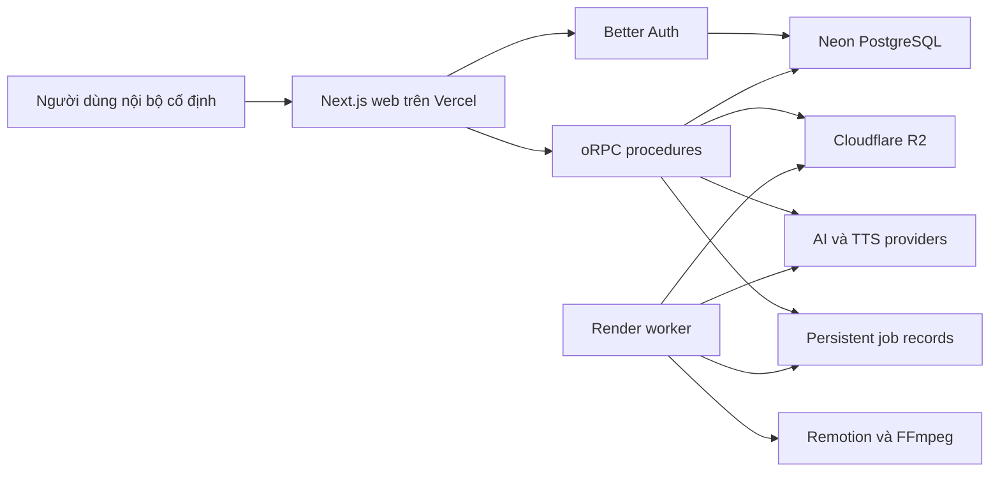
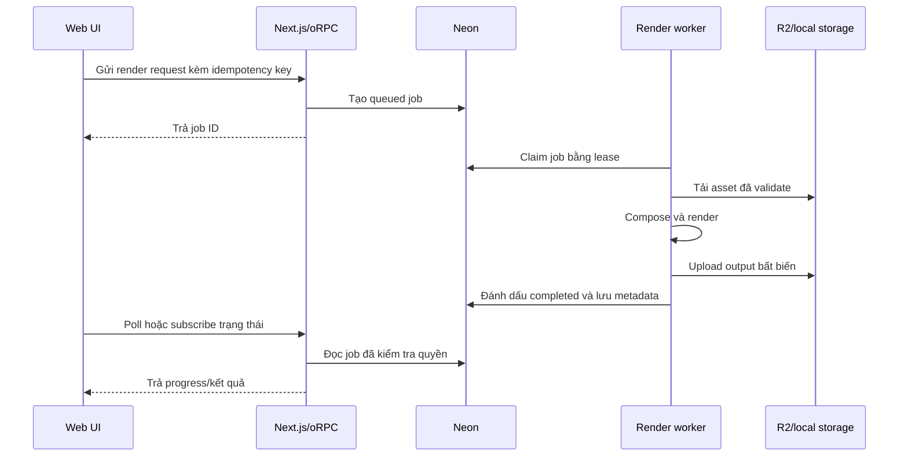

# Kiến trúc AffiChannel

- Trạng thái: Bản nháp
- Phiên bản: 0.1.0
- Cập nhật lần cuối: 2026-08-19

## 1. Mục tiêu kiến trúc

- Giữ luồng end-to-end đầu tiên đủ đơn giản cho một lập trình viên.
- Cho phép thay thế provider, storage và cách render.
- Thực thi authorization và các quy tắc workflow ở server.
- Lưu trạng thái job dài hạn bên ngoài vòng đời một web request.
- Cho phép truy vết fact, chi phí, asset AI và metrics.
- Không gắn business logic chặt vào Next.js route handler hoặc UI component.

## 2. Công nghệ hiện tại

| Khu vực | Lựa chọn |
|---|---|
| Web | Next.js 16 App Router và React 19 |
| API | oRPC với Zod contract và OpenAPI reference |
| Dữ liệu client | TanStack Query |
| Auth | Better Auth với email/mật khẩu |
| Database | Neon PostgreSQL |
| ORM | Drizzle ORM, ban đầu dùng Neon HTTP driver |
| UI | Tailwind CSS và shared shadcn-style primitives |
| Repository | pnpm workspace và Turborepo |
| Chất lượng | TypeScript và Biome |
| Deploy web | Vercel |
| Object storage | Cloudflare R2, thêm khi bắt đầu upload media |
| Render | Remotion và FFmpeg trong worker riêng |

`runtime: none` trong metadata scaffold nghĩa là không sinh backend runtime riêng.
Ứng dụng full-stack Next.js vẫn chạy code server trên Node.js runtime.

## 3. Cấu trúc repository mục tiêu

```text
affichannel/
├─ apps/
│  ├─ web/                  Next.js UI, auth route và oRPC transport
│  └─ worker/               Render và xử lý job dài hạn (thêm sau)
├─ packages/
│  ├─ api/                  oRPC procedure và request context
│  ├─ auth/                 Cấu hình Better Auth
│  ├─ core/                 Domain rule và application service (sẽ thêm)
│  ├─ db/                   Drizzle schema, migration và repository
│  ├─ env/                  Biến môi trường đã validate
│  ├─ storage/              Adapter R2/local (sẽ thêm)
│  ├─ ui/                   Shared UI primitive và token
│  └─ video/                Remotion composition và render contract (sẽ thêm)
├─ docs/                    Tài liệu sản phẩm và kỹ thuật chuẩn
└─ AGENTS.md                Quy tắc chung cho agent
```

Không đặt domain behavior tái sử dụng trong React component, route handler hoặc
worker entry point. Hãy đặt trong `packages/core` và gọi từ từng transport.

## 4. Ngữ cảnh hệ thống



## 5. Ranh giới request

### Server Components

Server Components có thể gọi trực tiếp application service hoặc read-model
function. Không gọi ngược HTTP endpoint của chính ứng dụng vì tạo thêm request
vòng không cần thiết.

### oRPC

Sử dụng oRPC cho:

- query và mutation bắt nguồn từ trình duyệt;
- polling hoặc event stream phía client;
- chuẩn bị upload và thao tác signed URL;
- API rõ ràng dành cho worker tương lai;
- thao tác cần typed contract công khai.

Một oRPC procedure thực hiện theo thứ tự:

1. validate input;
2. lấy authenticated session;
3. kiểm tra authorization ở mức bản ghi;
4. gọi application service;
5. ánh xạ typed error;
6. serialize response an toàn.

### Better Auth

Better Auth giữ endpoint `/api/auth/[...all]`. Không proxy qua oRPC. Kiểm tra
session cookie có thể cải thiện UX điều hướng, nhưng mọi page và procedure được
bảo vệ vẫn phải kiểm tra session và ownership thực sự.

### OpenAPI reference

API reference sinh tự động chỉ dành cho development. Tắt trong production hoặc
yêu cầu người dùng nội bộ đã đăng nhập.

## 6. Các domain module ban đầu

Triển khai module theo thứ tự phụ thuộc:

```text
identity
→ products
→ product-facts
→ projects
→ scripts
→ fact-lock
→ media
→ voice
→ video-composition
→ render-jobs
→ publishing
→ metrics
→ analytics
```

Mỗi module nên cung cấp application service và repository interface, không làm
rò rỉ transport object.

## 7. Data model ban đầu

Schema đầu tiên chỉ thêm những gì vertical slice hiện tại cần:

- Bảng Better Auth: `user`, `session`, `account`, `verification`.
- `product`.
- `product_fact`.
- `project`.
- `script_generation` khi bắt đầu AFF-US-008; `script_version` chỉ thêm ở AFF-US-009.
- `fact_lock_run`, `fact_lock_claim` và `fact_lock_claim_fact` khi bắt đầu AFF-US-010.

Quy tắc chung:

- Dùng opaque ID do ứng dụng tạo.
- Lưu timestamp theo UTC và hiển thị theo timezone cấu hình.
- Dùng `createdAt` và `updatedAt` nhất quán.
- Ưu tiên archive/chuyển trạng thái thay vì xóa cứng khi có bản ghi phụ thuộc.
- Thêm index cho foreign key và đường filter/sort thường dùng.
- Dùng unique constraint cho idempotency, không chỉ kiểm tra ở application.
- Mọi aggregate được bảo vệ phải lưu ownership hoặc group scope.

Không tạo tất cả bảng tương lai trong migration đầu tiên. Thêm schema cùng
vertical slice thực sự sử dụng nó.

## 8. Transaction và Neon

Database package hiện dùng `drizzle-orm/neon-http`, phù hợp với serverless
request ngắn. Trước workflow cần interactive transaction, phải xác nhận hỗ trợ
của driver và chuyển các đường đó sang Neon driver dùng pool/WebSocket nếu cần.

Import metrics, claim job và tạo version nhiều bản ghi phải atomic. Không giả lập
atomicity bằng nhiều request độc lập từ client.

## 9. Media và storage

Database chỉ lưu metadata và object key, không lưu binary media.

Storage adapter phải hỗ trợ:

- signed upload/download URL;
- giới hạn content type và kích thước;
- tạo object key độc lập với tên file gốc;
- checksum metadata;
- kiểm tra ownership trước khi ký URL;
- dọn file tạm;
- implementation local và R2 sau cùng một interface.

Khi phù hợp, phải validate MIME, extension, metadata đã decode, kích thước, thời
lượng, độ phân giải và domain nguồn. Coi URL đầu ra từ provider là input không
đáng tin cậy.

## 10. Kiến trúc job

Vercel tạo job và đọc trạng thái. Vercel không chạy FFmpeg hoặc Remotion dài hạn.



Thuộc tính job bắt buộc:

- state machine rõ ràng;
- idempotency key và unique constraint;
- lease owner và thời điểm hết hạn;
- heartbeat hoặc timeout có thể khôi phục;
- số lần retry hữu hạn;
- failure reason có kiểu rõ ràng;
- progress chỉ chuyển theo transition hợp lệ;
- quy tắc cancel;
- snapshot input bất biến;
- chi phí dự kiến và thực tế khi có phát sinh.

## 11. Provider adapter

Text AI, TTS, Video AI và storage provider phải được chọn ở server bằng cấu hình.
UI không được import provider SDK.

Mọi adapter tốn phí cung cấp các khái niệm tương đương:

- validate input;
- ước tính chi phí;
- submit hoặc execute;
- lấy provider request/job ID;
- chuẩn hóa trạng thái và lỗi;
- ghi actual cost/refund nếu có;
- loại secret và dữ liệu nhạy cảm khỏi log.

Provider relay bên thứ ba vẫn là thử nghiệm cho đến khi xác minh privacy, nguồn
upstream, độ ổn định và cơ chế refund.

Text generation dùng hai transaction ngắn: transaction đầu snapshot input và Fact revision,
tạo pending artifact/dependency rồi commit; provider call chạy ngoài transaction; transaction
sau conditional-finalize output/usage/error. Không giữ connection hoặc row lock khi chờ AI.
Chi tiết được khóa bởi DEC-015 và `docs/aff-us-008-foundation.md`.

## 12. Kiến trúc Fact Lock

Contract hardening của AFF-US-010 được khóa tại
`docs/aff-us-010-phase-0-contract-hardening.md`. Fact Lock run lưu persisted
status (`pending`, `review_required`, `passed`, `failed`, `indeterminate`); `stale`
là effective read-model state khi `ScriptVersion.revision` hoặc Product Fact
dependency không còn khớp, không phải một trạng thái mutate lịch sử. Claims
classification (`SUPPORTED`, `NEEDS_REVIEW`, `UNSUPPORTED`, `PROHIBITED`) tách khỏi
review status và AI không phải authority duy nhất cho `PROHIBITED`.

Fact Lock gồm các giai đoạn riêng:

1. tách candidate claim từ script version bất biến;
2. chuẩn hóa tên, giá trị, đơn vị, ngày và điều kiện khuyến mại;
3. đề xuất Product Facts có khả năng hỗ trợ;
4. áp dụng deterministic rule nếu có;
5. yêu cầu con người xử lý điểm mơ hồ;
6. lưu evidence link và lý do;
7. tính trạng thái tổng của run.

LLM output là structured input không đáng tin cậy và phải qua schema validation.
Model không được tự ghi trạng thái approved cuối cùng nếu thiếu server-side rule
và kiểm tra bằng chứng.

Trong runtime Phase 1, pending run phải giành execution claim bằng một UPDATE
atomic trước khi estimate hoặc gọi provider. Request không giành được claim chỉ
đọc kết quả hiện tại; stale claim kết thúc `indeterminate` bảo thủ và không retry.
Relation lưu trong mapping dùng allow-list `supports | related | contradicts`.
Fact revision là thuộc tính của từng mapping, không phải thuộc tính top-level của
claim. Review metadata được lưu tại claim; `MANUAL_APPROVED` cần reviewer và
`reviewed_at`, còn `AUTO_PASSED`/`UNRESOLVED` không có reviewer metadata.

## 12.1. Kiến trúc TTS của AFF-US-011 Phase 0

Contract AFF-US-011 được khóa tại
`docs/aff-us-011-phase-0-contract-decisions.md` và DEC-023. Production TTS đi
qua APIKEY.FUN relay với logical provider `apikeyfun`, credential server-only
`TTS_APIKEY_FUN_API_KEY`, base URL `TTS_APIKEY_FUN_BASE_URL` và canonical
`POST /v1/tts`. Text AI key không được dùng cho TTS.

Provider adapter và voice catalog thuộc server/application boundary. Relay không
expose `/v1/tts/voices`, vì vậy catalog verified được sở hữu ở server và client
chỉ nhận catalog đã validate. Client không gửi arbitrary provider, voice ID hoặc
credential.

Voice Studio reuse server-side `FactLockGate.assertPassed(actor, projectId)`.
Route Voice hiển thị locked state khi Fact Lock chưa PASS; không lưu unlock boolean.
Preview dùng text do server derive từ current ScriptVersion, gọi provider ngoài
database transaction và trả audio tạm thời qua protected binary endpoint với
canonical MIME `audio/mpeg`. Audio preview không lưu DB/object storage.

Timeout dùng `TTS_PREVIEW_TIMEOUT_MS`, provider failure không automatic retry,
và pricing relay hiện `UNVERIFIED`. Usage metadata chỉ reuse hạ tầng hiện có;
không tạo accounting subsystem riêng trong US11. Phase 0 không tạo schema,
migration hoặc runtime implementation.

### Phase 1 Voice Foundation

Phase 1 thêm `voice_config` additive với identity duy nhất theo
`(workspace_id, project_id)`. Core giữ catalog/validation provider-neutral; API
giữ adapter boundary và resolve `TTS_DEFAULT_PROVIDER` ở server. Config API luôn
resolve workspace/project từ `WorkspaceActor`, gọi server-side
`FactLockGate.assertPassed(actor, projectId)`, rồi mới đọc/ghi dữ liệu.

Create/update dùng transaction và optimistic revision CAS; client không được gửi
provider, workspace, revision hoặc audit fields. Phase 1 không giữ transaction
trong lúc chờ provider vì chưa có provider call; `ApiKeyFunTtsProvider.preview`
chỉ là boundary deferred cho Phase 2. Chi tiết schema/API/test nằm tại
`docs/aff-us-011-phase-1-foundation.md`.

### Phase 2 TTS Preview Runtime

Phase 2 nối `voice_config` với server-only `TtsProvider` registry. Adapter
`ApiKeyFunTtsProvider` dùng TTS credential riêng, một request `POST /v1/tts`,
không retry, timeout bounded, MIME `audio/mpeg` strict, empty/size guard và
safe error mapping. Preview service derive text từ current ScriptVersion ở server,
gọi `FactLockGate.assertPassed()` trước và ngay trước provider, rồi kiểm tra lại
ScriptVersion/gate/VoiceConfig revision. Không giữ DB transaction khi chờ TTS.

`POST /api/projects/:projectId/voice/preview` là protected binary route, không
nhận arbitrary text/config và không persist audio. Phase 2 không thêm migration,
usage/billing schema, cache, UI, full voiceover hoặc render. Chi tiết tại
`docs/aff-us-011-phase-2-tts-preview-runtime.md`.

## 13. Bất biến bảo mật

- Secret được validate ở server và không xuất qua `NEXT_PUBLIC_*`.
- Log loại credential, cookie, authorization header, signed URL và provider key.
- Procedure kiểm tra cả hành động và ownership bản ghi.
- File upload/download luôn được coi là không đáng tin cậy.
- URL bên ngoài được kiểm tra protocol và destination để giảm nguy cơ SSRF.
- Tham số FFmpeg được dựng từ giá trị đã validate, không nối từ raw user input.
- Có thể tắt đăng ký production sau khi tạo đủ tài khoản cố định.
- API reference và diagnostics không công khai trong production.

## 14. Cấu hình

Biến môi trường được khai báo và validate trong `packages/env`. Code mới không
đọc trực tiếp `process.env` ngoài package đó, trừ file cấu hình công cụ bắt buộc.

Biến bắt buộc hiện tại:

- `DATABASE_URL`;
- `DATABASE_URL_DIRECT` cho schema tooling;
- `BETTER_AUTH_SECRET`;
- `BETTER_AUTH_URL`;
- `CORS_ORIGIN`.

Chỉ thêm biến R2, AI, TTS và worker khi bắt đầu vertical slice tương ứng.

## 15. Cổng chất lượng

Trước khi hoàn thành một slice:

- Acceptance Criteria đạt;
- type-check đạt;
- Biome đạt mà không rewrite file không liên quan;
- migration được generate và review khi đổi schema;
- test authorization bao gồm truy cập chéo người dùng;
- domain rule quan trọng có unit test;
- luồng chính có integration hoặc Playwright test khi thực tế;
- tài liệu và tiến trình AI được cập nhật.

## 16. Các giai đoạn deploy

### Development local

- Next.js tại port 3002.
- Neon development database.
- Có thể dùng local filesystem adapter cho thử nghiệm media ban đầu.
- Local render worker khi bắt đầu render.

Runtime query dùng `DATABASE_URL` pooled; Drizzle schema tooling dùng
`DATABASE_URL_DIRECT`. Hai URL phải thuộc cùng một Neon project/branch.

### Production web

- Vercel cho Next.js.
- Neon cho PostgreSQL.
- R2 cho media và output render.
- Worker deploy riêng hoặc local worker được vận hành rõ ràng.

Agent không tự deploy production nếu chủ dự án chưa cho phép rõ ràng.
## AFF-US-007 — Transaction boundary và read model freshness

AFF-US-007 bổ sung `revision` cho `product_fact` và `product_fact_history`, cùng
`fact_dependency` và `fact_invalidation_event`. `fact_dependency.productFactId` cố ý không
có foreign key để giữ identity dependency sau hard delete Fact; event giữ `fromRevision`,
`toRevision`, dependent và reason.

Fact update/delete dùng optimistic compare-and-set theo `(id, workspaceId, revision)`. History,
mutation, revision bump, dependency invalidation và event phải chạy trong cùng transaction.
Register dependency không nhận revision từ client mà đọc revision hiện tại sau workspace
authorization; unique partial index bảo đảm idempotency cho dependency còn active.

Freshness được tính ở core từ date-only và business timezone, sau đó dùng lại cho Product Facts
list và Dashboard aggregate. Không tạo scheduler, warning table hoặc invalidation job riêng cho
clock freshness.

## AFF-US-008 — ScriptGeneration foundation

US8 lưu `script_generation` như generated artifact read-only, có full/partial output và reload
được. Artifact này không phải `script_version`; repair tạo child artifact mới. Input snapshot
chỉ chứa Project/Brief/Product và Facts có generation usability allowed hoặc
allowed-with-warning. Transaction prepare khóa Fact theo thứ tự ổn định và ghi dependency
`script_generation` bằng đúng revision đã snapshot; provider call luôn ở ngoài transaction.

Database enforce idempotency theo workspace, tối đa một pending generation mỗi Project và
lineage cùng workspace/project. Read model trả cả request mới nhất và artifact usable mới nhất,
để pending/failed/indeterminate không làm mất draft completed/partial trước đó.
Foundation hardening: `requestHash` chỉ hash `ClientGenerationIntent`; repair chỉ nhận parent
partial và merge server-side trước validate/persist child; provider messages giữ role separation;
timeout uncertain dùng `indeterminate`; stale transition cần created-at policy; DB CHECK khóa state
shape của completed/partial/failed. Live provider/API/UI vẫn nằm ngoài phase này.

### AFF-US-008 Phase 2A

AI generation input được resolve ở server từ Channel Settings, AI settings, Project/Content Brief,
Product Facts usable, Media Metadata và Output Rules. Snapshot v2 lưu config identity không có
secret. Provider adapter phải có cost preflight; deterministic chỉ được registry bật ở development
hoặc test, production không fallback sang provider giả. Protected oRPC gồm estimate, generate,
repair và getState; không nhận provider/model từ client và không tự advance workflow.

Phase 2A hardening giữ error boundary theo lớp: preflight provider/estimate có domain code và được
finalize một lần; lỗi persistence của estimate/finalize không bị đổi thành lỗi provider. Repair tạo
child từ parent partial, giữ nguyên root metadata và các section hợp lệ ngoài tập repair. Output
validator enforce language theo Output Rules, disclosure theo Channel Settings và `avoidWords` ở cả
prompt/domain; vi phạm section được ghi nhận theo partial semantics. Provider chỉ thấy media
`ready` với quyền `owned` hoặc `licensed`; không có media usable không chặn generation. oRPC hiện
dùng standard serializer built-in cho `bigint`, nên các trường cost giữ nguyên `bigint` trong domain/API
contract để không mất precision.

### AFF-US-008 Phase 2B — Live TextProvider

Live text chạy qua `TextProvider` registry; ScriptGenerationService không biết
APIKEY.FUN-specific payload. Adapter server-only `ApikeyFunTextProvider` dùng
Anthropic Messages `POST /v1/messages` với SSE theo contract đã audit, model mặc
định cấu hình là `claude-sonnet-4-6`. AI Settings vẫn quyết định logical
provider/model; API key, base URL, timeout và pricing versioned chỉ nằm trong
server environment.

APIKEY.FUN không công bố structured-output/JSON-Schema contract và pricing
preflight đủ ổn định trong tài liệu hiện tại. Adapter vì vậy chỉ yêu cầu JSON ở
prompt, parse response rồi giao cho Zod/domain validator; cost estimate dùng
pricing config server-side, thiếu config thì fail closed. Không scrape pricing,
không giả cost zero và không đổi currency provider sang VND trong adapter.

HTTP error được normalize về domain error hiện có; timeout/network sau khi request
có thể đã được nhận đi theo uncertain/indeterminate, không automatic retry. Raw
provider body, API key và prompt không được log hoặc trả cho client. `getState`
tiếp tục DB-only; Phase 2B không tạo migration.
